# SPRINT 04
Para conseguir hacer la conexión de la base de datos con la web, tenemos que crear un fichero de js que contenga el enlace de la API, una función que haga fetch y un bucle para que muestre cada usuario.

## APP ANDROID

### Fragment Top
Barra superior de toda la app
  
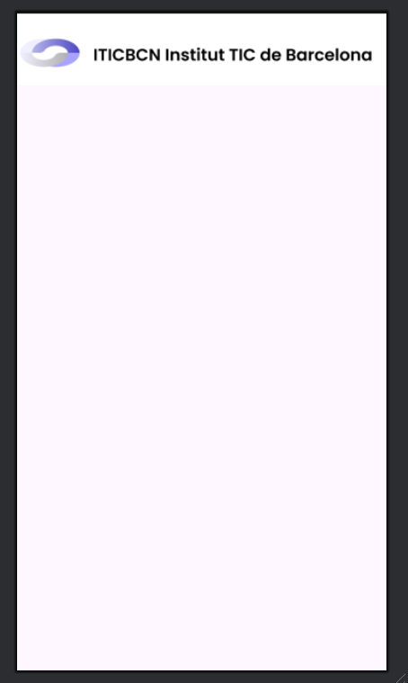

### Fragment Bottom Alumno
Barra inferior apartado alumno
  
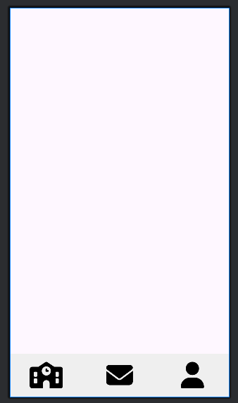

### Fragment Bottom Profesor
Barra inferior apartado profesor
  
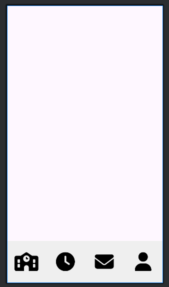

### Fragment Bottom Admin
Barra inferior apartado administrador
  
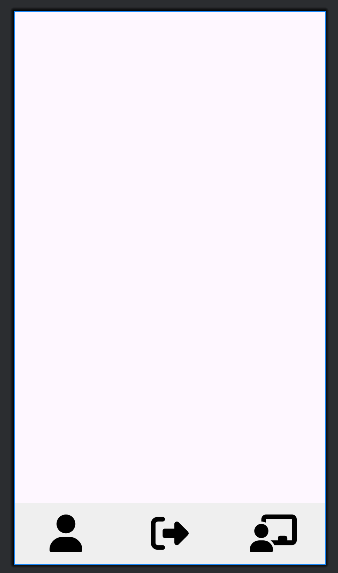

### Logi
El login tiene un campo para poner el mail, y uno para su contraseña. También se podría realizar el login con el correo corporativo. También existe la opción de recuperar la contraseña.
  
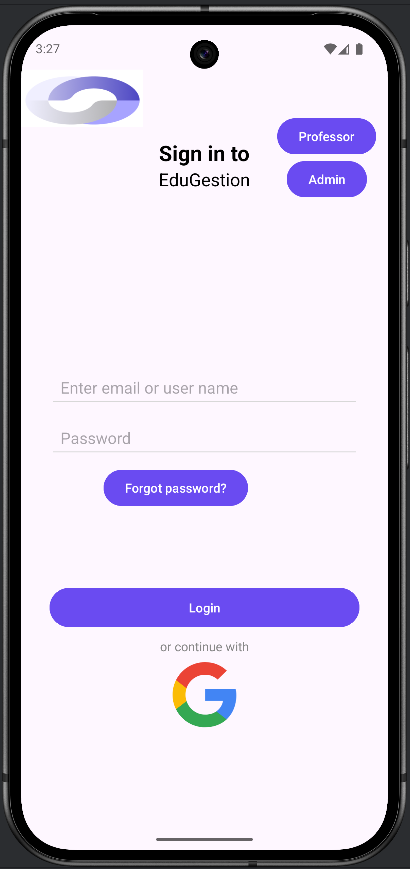

### Recuperar Contraseña
Recuperar contraseña tiene 2 pantallas, donde se pone el mail para enviar el correo para poder acceder a la segunda pantalla que es la de confirmar la contraseña. 

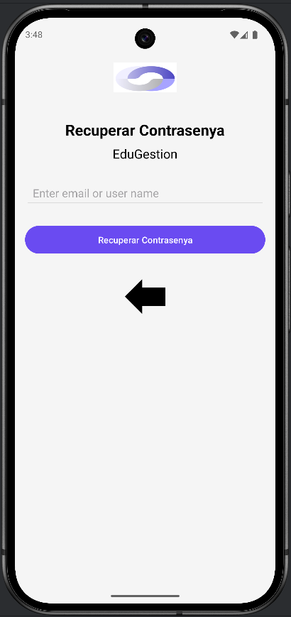
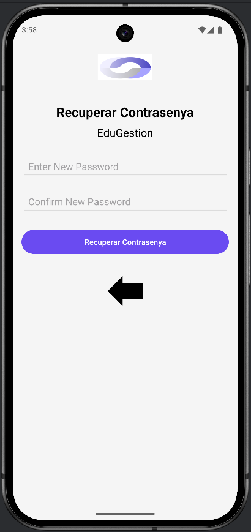

### Alumno Asistencia
La asistencia es la página principal, te muestra la asistencia de hoy y una gráfica del porcentaje asistencia, también tiene un filtro para filtrar entre hoy, ayer, los últimos 7 días y esta semana.

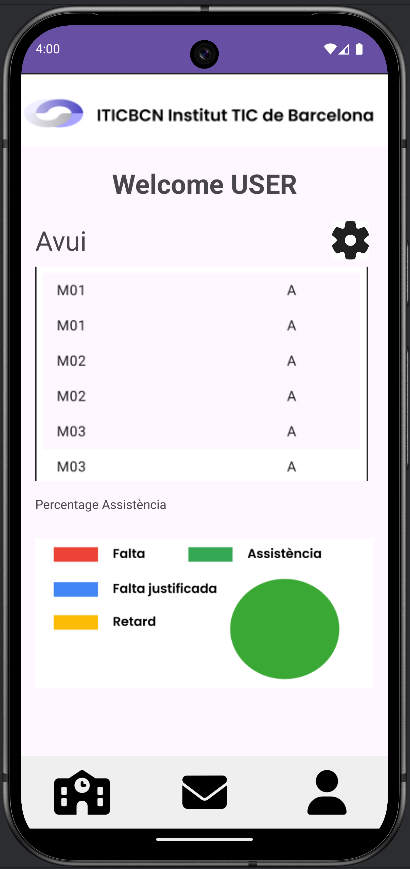

### Alumno Bandeja de entrada
En la bandeja de entrada el alumno ve al remitente y el asunto del mensaje, después hay unos botones para poder navegar entre las diferentes páginas que puede haber.

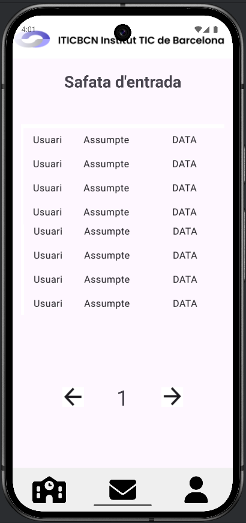

### Alumno Datos personales
La página de datos personales muestra el Nombre, Apellido, Teléfono, Mail y DNI del alumno.

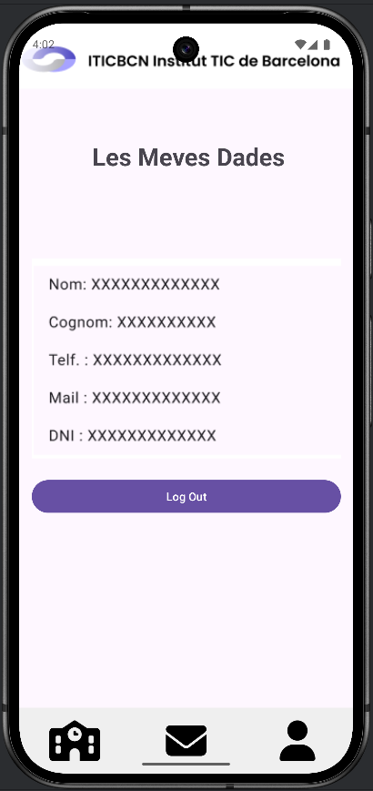

### Profesor Asistencia
Para poder pasar lista, debe seleccionar un grupo, después obtiene la lista de alumnos donde puede marcar retraso, falta y asistencia.

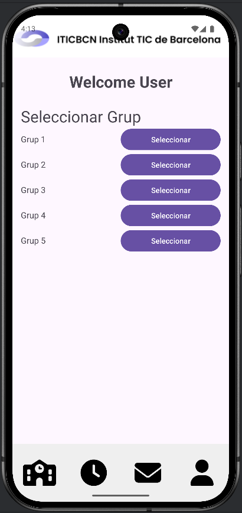

### Profesor Horario
La página de horario muestra el horario de clases y horas de guardia del profesor en cuestión

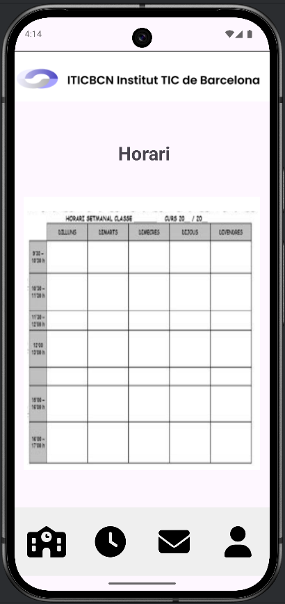

### Profesor Bandeja de entrada
En la bandeja de entrada el alumno ve al remitente y el asunto del mensaje, después hay unos botones para poder navegar entre las diferentes páginas que puede haber.

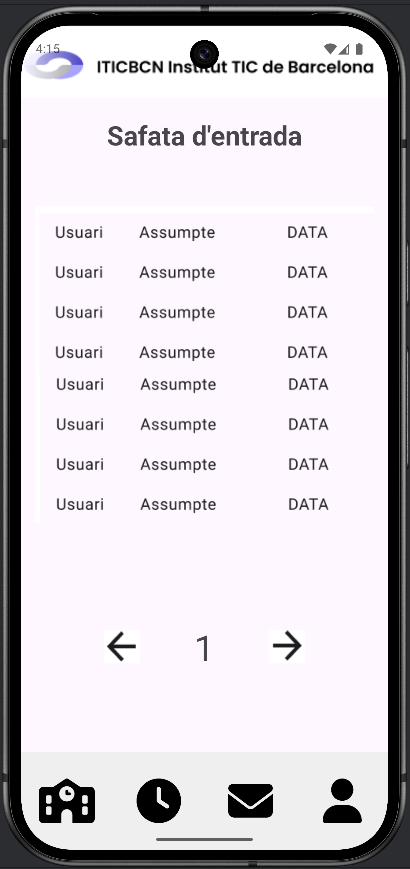

### Professor Datos personales
La página de datos personales muestra el Nombre, Apellido, Teléfono, Mail y DNI del profesor.

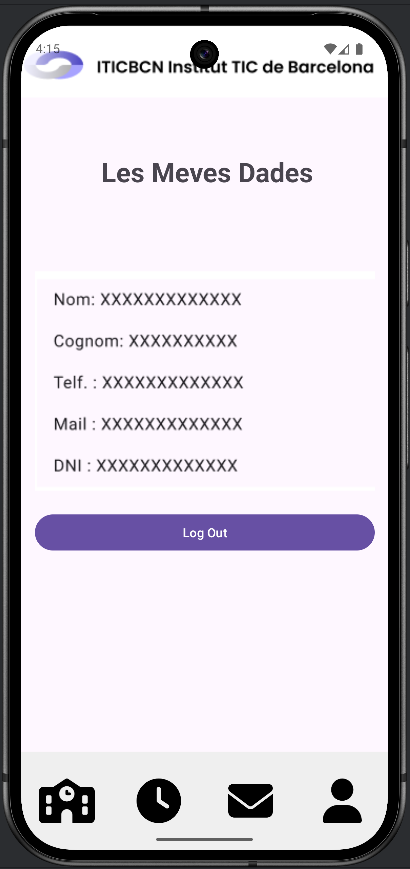

### Administrador
El admin puede ir a alumnos para poder añadir, modificar y eliminar o ir a profesores para poder hacer lo mismo.

### Admin Alumnos
Vista de los usuarios alumnos con su mail, tienen un botón por modificar y uno para eliminar. Debajo de todo hay un botón para navegar entre las páginas.

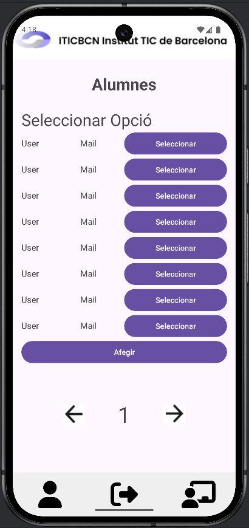

### Admin Profesores
Vista de los usuarios profesores con su mail, tienen un botón por modificar y uno para eliminar. Debajo de todo hay un botón para navegar entre las páginas.

## Añadir
Formulario para añadir Alumno o Profesor.

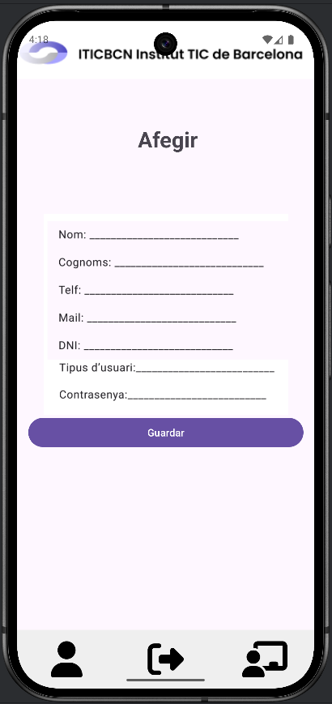

## Modificar
Formulario para modificar alumno o profesor.

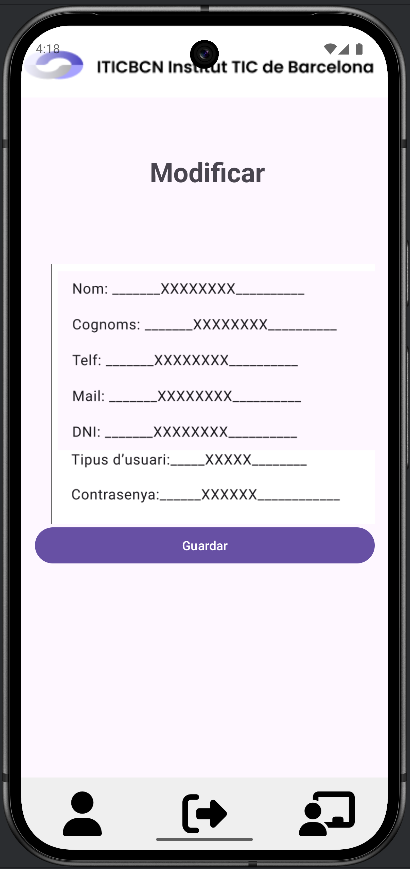
