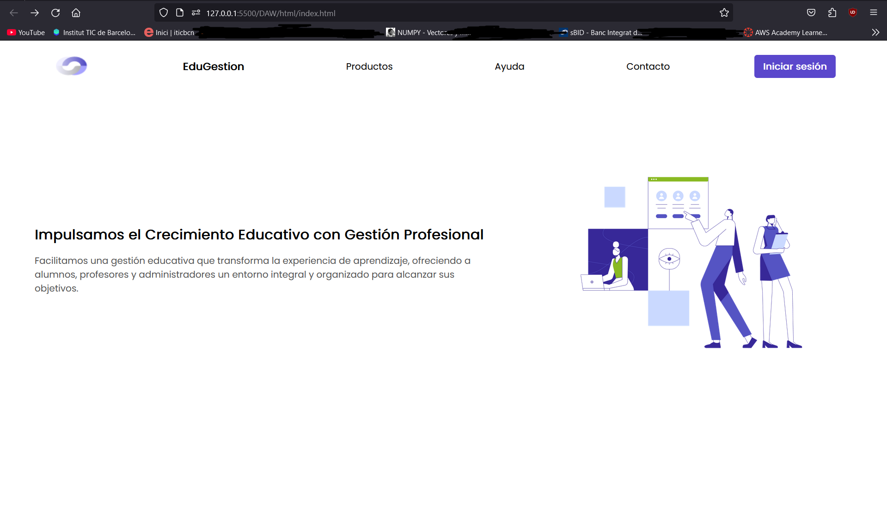
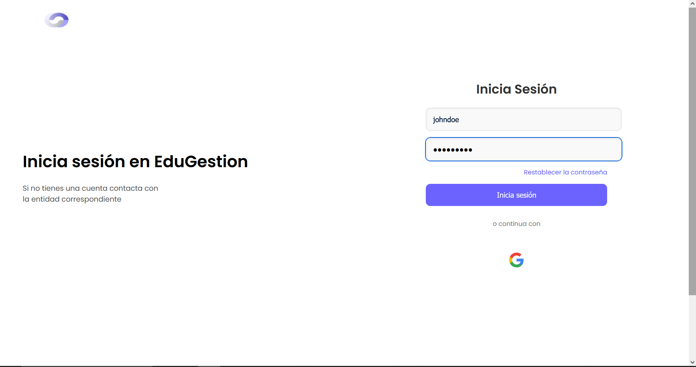
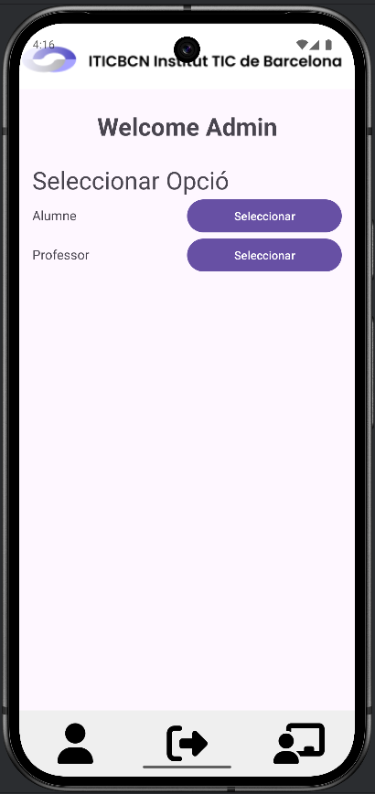

# SPRINT 04
Para poder hacer este sprint hacia falta conectarse a la base de datos para coger y recibir datos. Para eso se ha usado un fetch que ha servido para redirigir a X pagina dependiendo que rol tiene cada usuario.

## Página principal
La primera página es la de inicio que tenemos el botón de iniciar sesión que si le damos nos lleva a la página de iniciar sesión.

## Página de inicio de sesión
En la página de inicio de sesión dependiendo que usuario ponemos nos lleva a la página del alumno, del profesor o del administrador.

## Páginas principales
La página del alumno tiene esta página como principal. Podemos ver que arriba pone el nombre del usuario que se ha recogido de la base de datos. Y lo mismo con la página del profesor y del administrador.
### Alumno:

### Profesor:

### Administrador:

## Página para añadir a los alumnos y profesores
En la página del administrador podemos ir a la página para añadir alumnos o profesores:

## Página log out
Por último, todas las páginas tienen un log out que nos lleva a la página de inicio de sesión.

## APP ANDROID

### Fragment Top
Barra superior de toda la app
  

### Fragment Bottom Alumno
Barra inferior apartado alumno
  

### Fragment Bottom Profesor
Barra inferior apartado profesor
  

### Fragment Bottom Administrador
Barra inferior apartado administrador
  

### Logi
El login tiene un campo para poner el mail, y uno para su contraseña. También se podría realizar el login con el correo corporativo. También existe la opción de recuperar la contraseña.
  

### Recuperar Contraseña
Recuperar contraseña tiene 2 pantallas, donde se pone el mail para enviar el correo para poder acceder a la segunda pantalla que es la de confirmar la contraseña. 

### Alumno Asistencia
La asistencia es la página principal, te muestra la asistencia de hoy y una gráfica del porcentaje asistencia, también tiene un filtro para filtrar entre hoy, ayer, los últimos 7 días y esta semana.

### Alumno Bandeja de entrada
En la bandeja de entrada el alumno ve al remitente y el asunto del mensaje, después hay unos botones para poder navegar entre las diferentes páginas que puede haber.

### Alumno Datos personales
La página de datos personales muestra el Nombre, Apellido, Teléfono, Mail y DNI del alumno.

### Profesor Asistencia
Para poder pasar lista, debe seleccionar un grupo, después obtiene la lista de alumnos donde puede marcar retraso, falta y asistencia.

### Profesor Horario
La página de horario muestra el horario de clases y horas de guardia del profesor en cuestión

### Profesor Bandeja de entrada
En la bandeja de entrada el alumno ve al remitente y el asunto del mensaje, después hay unos botones para poder navegar entre las diferentes páginas que puede haber.

### Professor Datos personales
La página de datos personales muestra el Nombre, Apellido, Teléfono, Mail y DNI del profesor.

### Administrador
El admin puede ir a alumnos para poder añadir, modificar y eliminar o ir a profesores para poder hacer lo mismo.

### Admin Alumnos
Vista de los usuarios alumnos con su mail, tienen un botón por modificar y uno para eliminar. Debajo de todo hay un botón para navegar entre las páginas.

### Admin Profesores
Vista de los usuarios profesores con su mail, tienen un botón por modificar y uno para eliminar. Debajo de todo hay un botón para navegar entre las páginas.

## Añadir
Formulario para añadir Alumno o Profesor.

## Modificar
Formulario para modificar alumno o profesor.

