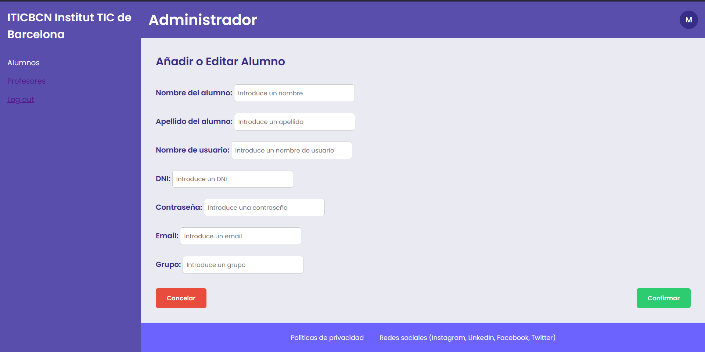

# SPRINT 04
Para poder hacer este sprint hacia falta conectarse a la base de datos para coger y recibir datos. Para eso se ha usado un fetch que ha servido para redirigir a X pagina dependiendo que rol tiene cada usuario.

## Página principal
La primera página es la de inicio que tenemos el botón de iniciar sesión que si le damos nos lleva a la página de iniciar sesión.

## Página de inicio de sesión
En la página de inicio de sesión dependiendo que usuario ponemos nos lleva a la página del alumno, del profesor o del administrador.

## Páginas principales
La página del alumno tiene esta página como principal. Podemos ver que arriba pone el nombre del usuario que se ha recogido de la base de datos. Y lo mismo con la página del profesor y del administrador.
### Alumno:

### Profesor:

### Administrador:

## Página para añadir a los alumnos y profesores
En la página del administrador podemos ir a la página para añadir alumnos o profesores:

## Página log out
Por último, todas las páginas tienen un log out que nos lleva a la página de inicio de sesión.

